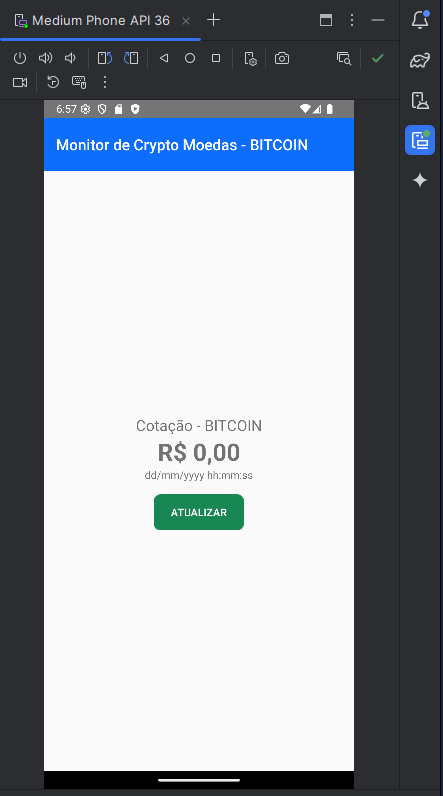
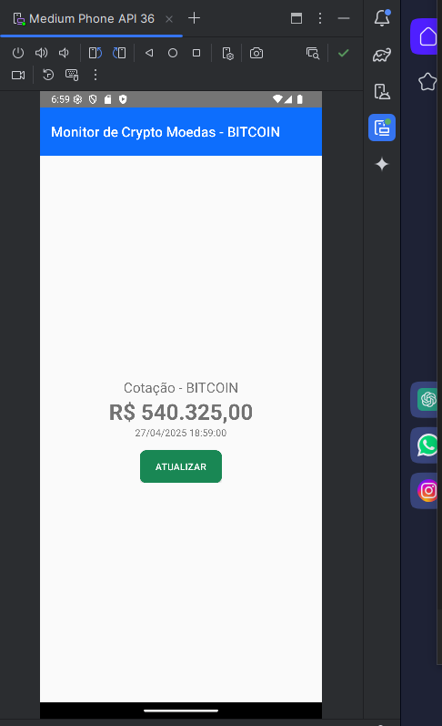

# Crypto Monitor

Projeto desenvolvido para monitorar a cotação de criptomoedas.

## Explicação dos Arquivos Kotlin

### Service
Arquivo responsável por fazer a chamada para a API que fornece o preço da criptomoeda.

### Factory
Arquivo que cria e configura o serviço que faz a chamada da API.

### Main
Arquivo principal do app, onde fica a interface do usuário (UI) e o botão para buscar a cotação.

### Model
Arquivo que define o modelo de dados usado para representar as informações da API.

## Evidências

### Tela antes de buscar a cotação:

### Tela depois de buscar a cotação:

